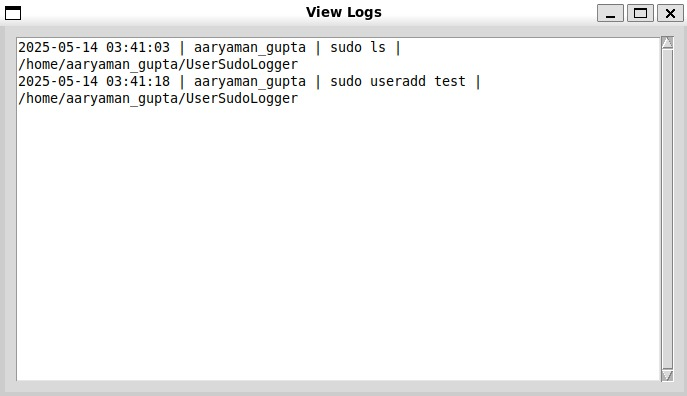

# User Sudo Logger

🔐 **User Sudo Logger GUI**

A Python-based tool that automatically logs `sudo` commands, detects dangerous commands, sends alerts via pop-ups and email, and generates daily reports. It is designed to enhance system security by monitoring user activities and providing an easy-to-use graphical interface for log management.

---

# 👥 Team Members

| Aaryaman Gupta | Aaradhya Mittal |
| ------------- | ------------- |
| Abhishek Gupta | Aditi Saini  |

---

# 📋 Project Overview

The **User Sudo Logger** is a Linux-based Python application that tracks all `sudo` commands entered by users. It automatically logs each sudo command, detects potentially dangerous commands, and sends alerts via both pop-up notifications and email. It also provides users with daily reports of executed sudo commands, which are stored permanently and cannot be deleted. The user can manage logs, view reports, and clear the log history without affecting the daily reports. 

  

    
    
    

---

# ✨ Features

- **Automatic Logging**: Logs all `sudo` commands entered by the user, including timestamp, user, command, and directory.
- **Dangerous Command Detection**: Flags and alerts the user if any dangerous commands (e.g., `rm -rf /`, `useradd`) are executed.
- **Email Alerts**: Sends email notifications when dangerous commands are detected using the `alert-email.sh` script.
- **Daily Reports**: Generates daily reports that track the sudo commands executed on specific dates.
- **Log Management**: Allows the user to view logs, clear log history (without affecting daily reports), and view specific day reports.
- **Graphical User Interface**: Simple and intuitive GUI for interaction, built with Python's Tkinter.

---

# 🔧 Built With

- **Python 3.x**
- **Tkinter (GUI)** for the user interface
- **os, subprocess, datetime** (Standard libraries)
- **alert-email.sh** (for sending email alerts)
- **Linux Environment** for the execution of sudo commands

---

# 🛠️ Technical Implementation

The project uses Python and Tkinter to provide an interactive graphical user interface. The program detects any sudo command entered by the user and logs it to a text file, while also monitoring for any dangerous commands. If a dangerous command is executed, an alert is sent via both pop-up notifications and email. The system also generates daily reports of the logged sudo commands.

## System Architecture

 

  

---

# 🎓 Learning Outcomes

- Built a Python-Tkinter GUI for system activity logging and monitoring.
- Gained experience in automatically logging system commands and implementing alerts.
- Learned how to integrate email notifications into a Python application.
- Developed skills in managing logs and reports efficiently.
- Improved understanding of security monitoring and the detection of dangerous commands.
- Enhanced knowledge of file management and report generation.

---

# 📝 Project Report

The detailed project report includes:

- System architecture
- Implementation details
- Testing methodology
- Performance analysis
- Future improvements

---

# 🤝 Acknowledgments

We would like to thank our mentors and instructors for their valuable guidance and support throughout the development of this project.

Developed as part of the **System Security Monitoring Course**

© 2025 Team SudoLoggerScript

---
